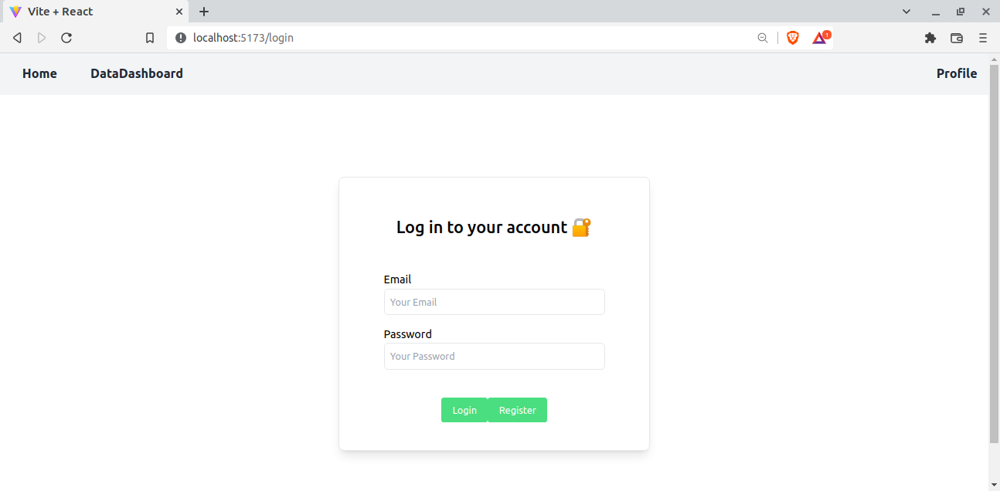
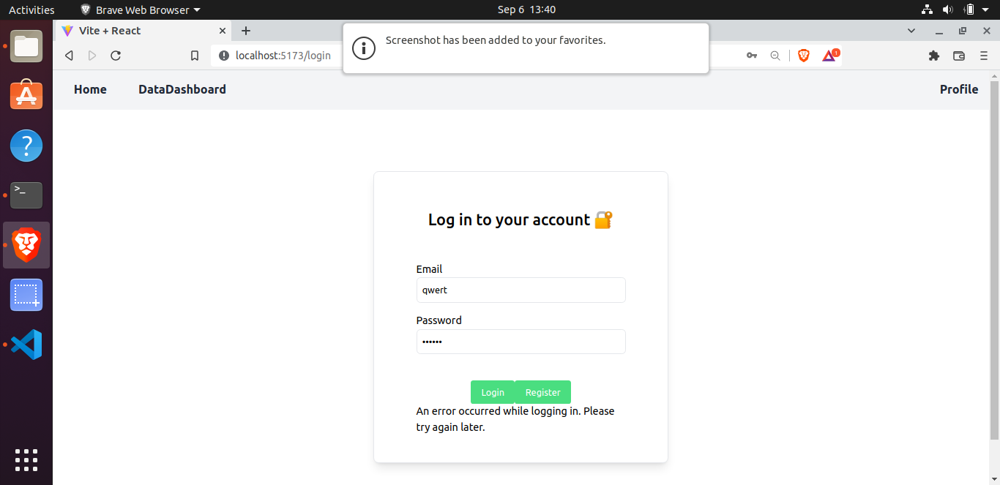
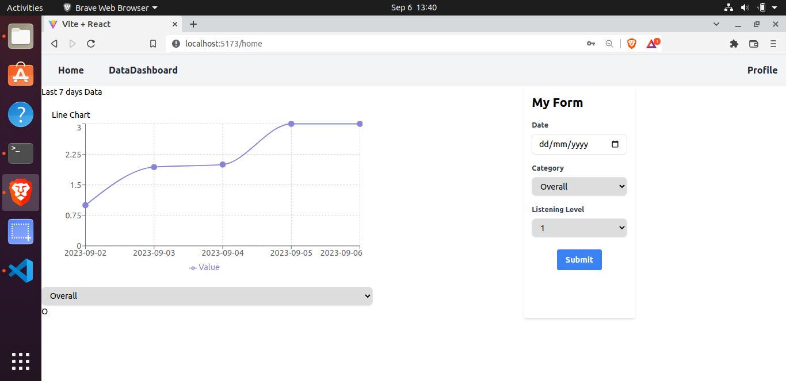
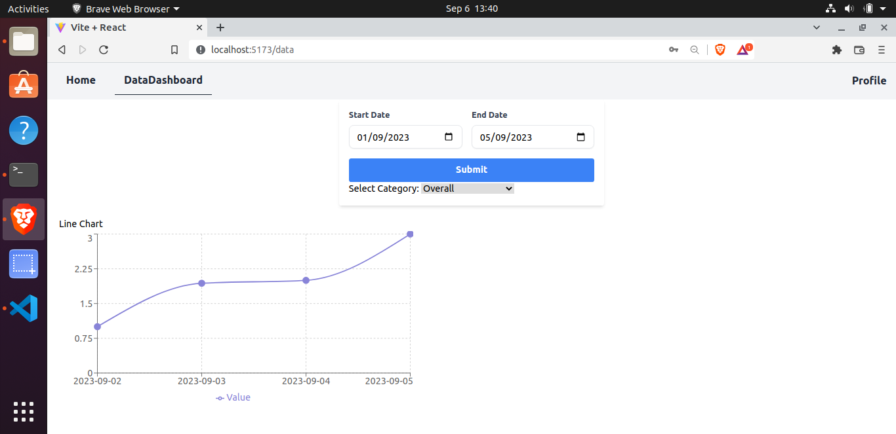
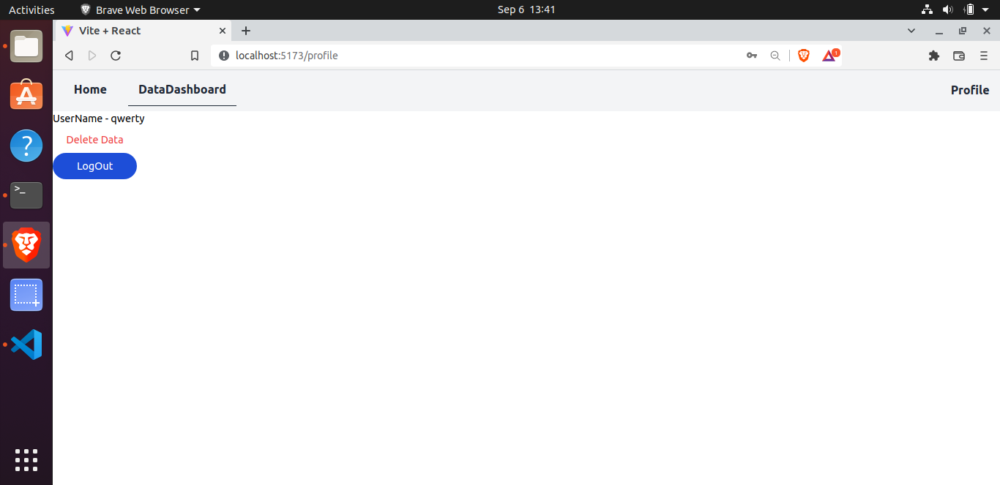

# Project Name

A full-stack web application built with Spring Boot, React, and MySQL, featuring user authentication with Spring Security.

## Table of Contents

- [Introduction](#introduction)
- [Features](#features)
- [Technologies Used](#technologies-used)
- [Folder Structure](#folder-structure)

## Introduction

This project is a full-stack web application that combines the power of Spring Boot and React to create a robust and secure web application. It uses Spring Security for user authentication and MySQL for data storage (with the database name set to "recorddb"). React is used for the front end, with custom hooks for creating context, and React Router for routing between different views.

## Features

- User authentication and authorization using Spring Security.
- CRUD operations with a MySQL database (database name: "recorddb").
- Secure API endpoints to protect sensitive data.
- Dynamic and responsive user interface with React.
- Routing and navigation using React Router.
- Custom hooks for state management.

## Technologies Used

- **Backend**:
  - Spring Boot: A powerful Java-based framework for building robust backend applications.
  - Spring Security: Provides authentication and authorization for your application.
  - MySQL: A relational database for storing and managing data (database name: "recorddb").

- **Frontend**:
  - React: A popular JavaScript library for building user interfaces.
  - React Router: Used for client-side routing and navigation.
  
- **State Management**:
  - Custom React Hooks: For creating context and managing application state.

## Folder Structure
- The project directory structure is organized as follows:

 - backend: Contains the Spring Boot backend code.
 - frontend: Contains the React frontend code.

